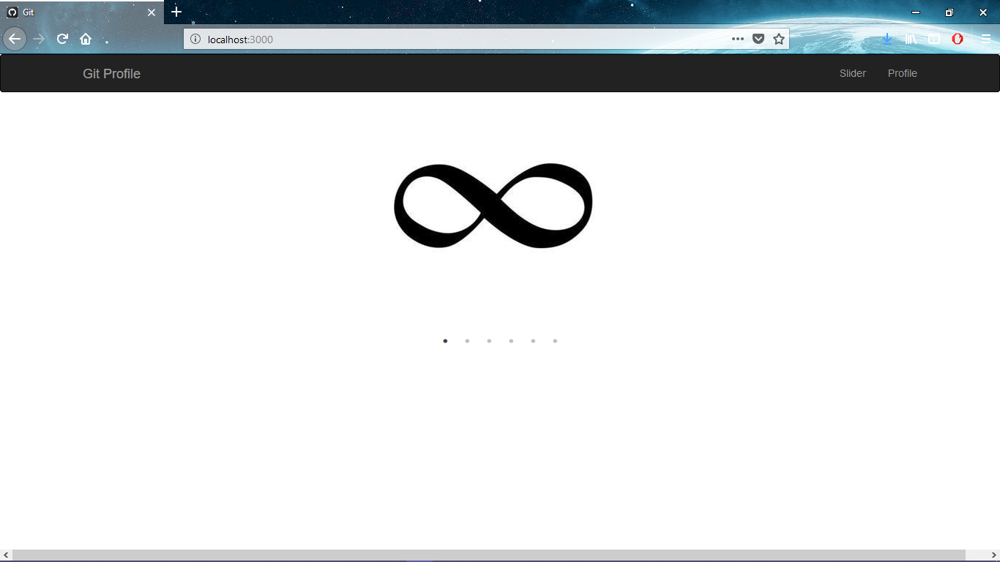
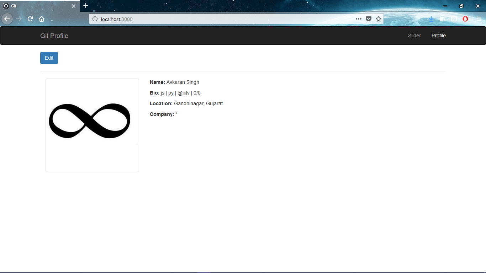
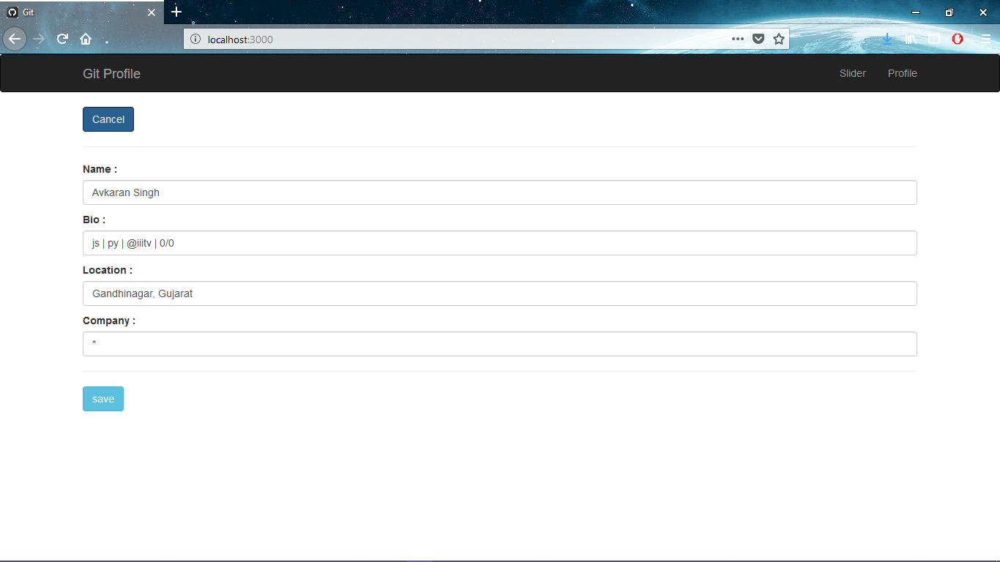

Edit your Git profile

## Generate git token

https://github.com/settings/tokens

## Add token

copy & paste token in this file https://github.com/avsingh999/git_profile/blob/master/src/actions/actions_profile.js                                                                                                    
line: 9 & line: 31 
And add your user name in line: 11

## Install packages

```
npm install
```

## Run
```
npm start
```
or
```
yarn start
```
## Preview







## Author

Avkaran Singh

[](https://twitter.com/avsingh07492100)
[](https://www.linkedin.com/in/avkaran-singh-a1ba3613b/)
[](https://github.com/avsingh999)

## License

[](#)

